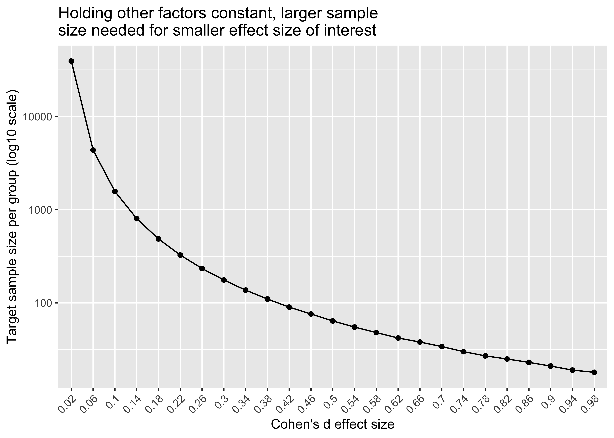
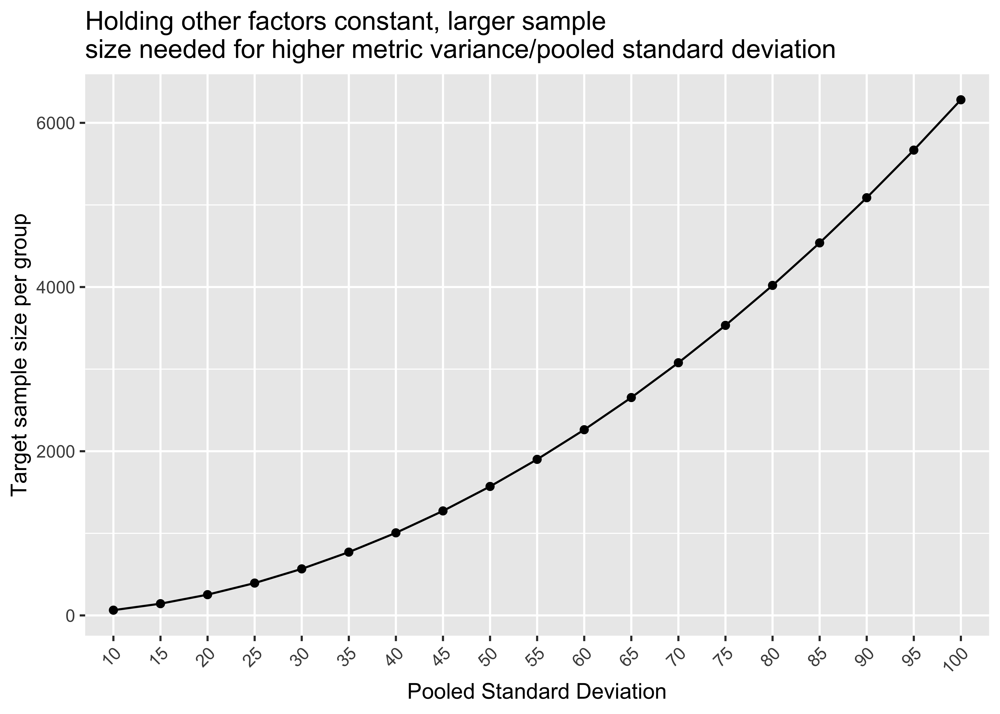
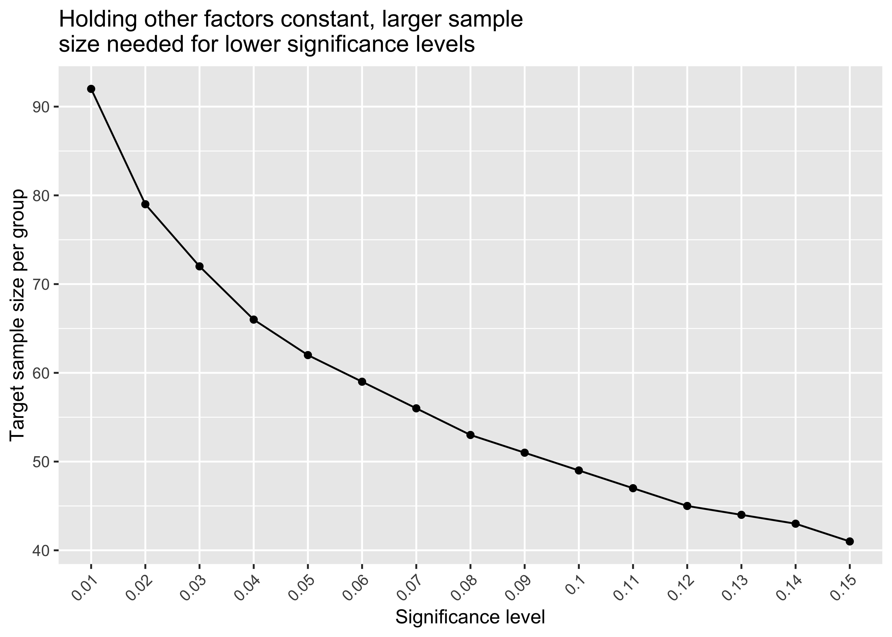

Two Sample T-test Power Analysis
================

``` r
library(tidyverse)
library(pwr)
library(kableExtra)
```

### Scenario

  - **Setup**: imagine we are tasked with running an online A/B test
    with a primary metric of revenue per visitor (e.g. total revenue
    during test window / unique visitors during test window). Our test
    will have a control group (status quo experience) and a treatment
    group (new experience aimed at increasing revenue per visitor).
    We’ll use a Welch two independent sample t-test with unequal
    variances to assess if there’s a difference in means between the
    control and treatment group means.
  - **Null hypothesis**: control mean - treatment mean = 0 (e.g. no
    difference in means between groups)
  - **Alternative hypothesis**: control mean - treatment mean \!= 0
    (e.g. difference in means between groups)
  - **Estimating test duration with power analysis**: we can use power
    analysis to derive a target sample size per test group. For a given
    traffic allocation, the target sample size per group sets
    expectations on test duration and establishes test stopping
    criteria. Experiment owners use historical test surface visitor data
    to derive estimates on how long the target sample size will take to
    collect.

### Recap of factors that influence test duration

  - **Minimum effect size**: in our scenario, the minimum effect size
    represents the smallest effect size that is meaningful for the
    business. Holding other factors constant, smaller minimum effect
    sizes require larger sample size.
  - **Significance level**: probability of observing an effect by
    chance. In other words, probability of rejecting the null hypothesis
    when the null hypothesis is true (i.e. claiming there is an effect
    when there isn’t). Holding other factors constant, lowering
    significance level (also called alpha or type 1 error rate)
    increases sample size requirements. Side bar: when our test pvalue
    is below the pre-specified significance level we reject the null
    hypothesis in favor of the alternative hypothesis For the above
    scenario, analysis is done only at test end when the sample size
    target is reached.
  - **Power**: probability of detecting an effect when one exists. Said
    differently, probability of correctly rejecting the null hypothesis
    when the alternative is true (1 - type 2 error rate). We call a test
    underpowered when the sample size is not sufficient to detect an
    effect size of interest. A test is overpowered when we greatly
    surpass the target sample size per group.
  - **Time to collect target sample size by group**: varies based on
    test traffic allocation and experiment surface area popularity.

### Gaining intuition for power

  - We can simulate 10k trials of an A/B test below with known control
    and treatment population parameters.
  - The true effect between the groups is known. However, we will
    pretend we don’t know the true effect size and use sample data to
    estimate the true effect.
  - For the 10k simulated A/B tests, empirical power represents the
    proportion of pvalues below our significance level of 0.05.
  - We expect empirical power to closely resemble power from the
    functions below.

<!-- end list -->

``` r
### fake revenue per visitor metrics
### known control and treatment population parameters
c_mu <- 50
c_s <- 12
t_mu <- 45
t_s <- 7
### sample size to pull from known population parameter
n <- 50

welch_ttest_sim <- function(group_sample_size, 
                            control_pop_mean,
                            control_pop_sd,
                            treatment_pop_mean,
                            treatment_pop_sd) {
  ### generate random sample for control with pop mean and sd inputs
  control <- rnorm(group_sample_size, 
                   mean = control_pop_mean, 
                   sd = control_pop_sd)
  ### generate random sample for treatment with pop mean and sd inputs
  treatment <- rnorm(group_sample_size, 
                     mean = treatment_pop_mean, 
                     sd = treatment_pop_sd)
  t.test(control, treatment)$p.value
}

### 10k trials of generating control and treatment samples from known population
sim_results <- replicate(10000, welch_ttest_sim(n, c_mu, c_s, t_mu, t_s)) 

### empirical power: proportion of simulation pvalues below 0.05
paste0("Simulation of 10k A/B tests and the proportion of pvalues below 0.05 = ",
      round(sum(sim_results < 0.05)/length(sim_results)*100,2), "%")
```

    ## [1] "Simulation of 10k A/B tests and the proportion of pvalues below 0.05 = 70.93%"

##### Power calculation using pwr package

  - Empirical power closely ties with power derived using a mathematical
    approach.
  - If we were to increase the number of simulation trials from 10k to
    1M we’d expect the results to align even closer.

<!-- end list -->

``` r
### pooled sd simple formula: sqrt((s1^2 _ s2^2)/2)
### ties with Cohens formula: sqrt(((n1-1)s1^2 +  (n2-1)s2^2) / (n1+n2-2))
pooled_sd <- sqrt((c_s^2 + t_s^2)/2)
diff_between_means <- c_mu-t_mu
effect_size <- diff_between_means/pooled_sd

result <- pwr::pwr.t.test(n = 50, d = effect_size, sig.level = 0.05,
           type="two.sample", alternative="two.sided") 

paste0("Power = ", round(result$power*100,2), "%")
```

    ## [1] "Power = 71.23%"

``` r
result
```

    ## 
    ##      Two-sample t test power calculation 
    ## 
    ##               n = 50
    ##               d = 0.5089866
    ##       sig.level = 0.05
    ##           power = 0.7122507
    ##     alternative = two.sided
    ## 
    ## NOTE: n is number in *each* group

### Power analysis to derive sample size target

  - Industry defaults: power is typically set to 0.8, significance level
    to 0.05, minimum effect size calculated based on historical data and
    business context.
  - For simplicity we use the above effect size (cohen’s d formula) as
    our minimum effect size of interest.
  - What is the sample size per group we need for 80% test power?

<!-- end list -->

``` r
n_result <- pwr::pwr.t.test(power=0.8, 
                d = effect_size, 
                sig.level = 0.05,
                type="two.sample", 
                alternative="two.sided") 

paste0("Sample size target per group = ", ceiling(n_result$n))
```

    ## [1] "Sample size target per group = 62"

``` r
n_result
```

    ## 
    ##      Two-sample t test power calculation 
    ## 
    ##               n = 61.56845
    ##               d = 0.5089866
    ##       sig.level = 0.05
    ##           power = 0.8
    ##     alternative = two.sided
    ## 
    ## NOTE: n is number in *each* group

### Visualizing sample size tradeoffs

``` r
tibble(effect_size_inputs = seq(0.02, 1, 0.04)) %>%
  rowwise() %>%
  mutate(target_sample_size_per_group = 
           ceiling(
             pwr::pwr.t.test(power=0.8, 
                d = effect_size_inputs, 
                sig.level = 0.05,
                type="two.sample", 
                alternative="two.sided")$n
            )
        ) %>%
  ggplot(aes(x=factor(effect_size_inputs),
             y=target_sample_size_per_group,
             group=1)) +
  geom_point() +
  geom_line() +
  theme(axis.text.x = element_text(angle = 45, hjust = 1, vjust = 1)) +
  scale_y_log10() +
  labs(title="Holding other factors constant, larger sample
size needed for smaller effect size of interest",
       y="Target sample size per group (log10 scale)",
       x="Cohen's d effect size")
```



``` r
tibble(pooled_sd_inputs = seq(100,10,-5)) %>%
  rowwise() %>%
  mutate(target_sample_size_per_group = 
           ceiling(
             pwr::pwr.t.test(power=0.8, 
                d = diff_between_means/pooled_sd_inputs, 
                sig.level = 0.05,
                type="two.sample", 
                alternative="two.sided")$n
            )
        ) %>%
  ggplot(aes(x=factor(pooled_sd_inputs),
             y=target_sample_size_per_group,
             group=1)) +
  geom_point() +
  geom_line() +
  theme(axis.text.x = element_text(angle = 45, hjust = 1, vjust = 1)) +
  labs(title="Holding other factors constant, larger sample
size needed for higher metric variance/pooled standard deviation",
       y="Target sample size per group",
       x="Pooled Standard Deviation")
```



``` r
tibble(sig_level_inputs = seq(0.01, 0.15, 0.01)) %>%
  rowwise() %>%
  mutate(target_sample_size_per_group = 
           ceiling(
             pwr::pwr.t.test(power=0.8, 
                d = effect_size, 
                sig.level = sig_level_inputs,
                type="two.sample", 
                alternative="two.sided")$n
            )
        ) %>%
  ggplot(aes(x=factor(sig_level_inputs),
             y=target_sample_size_per_group,
             group=1)) +
  geom_point() +
  geom_line() +
  theme(axis.text.x = element_text(angle = 45, hjust = 1, vjust = 1)) +
  labs(title="Holding other factors constant, larger sample
size needed for lower significance levels",
       y="Target sample size per group",
       x="Significance level")
```



### Related topics / further research

  - Most sophisticated companies running online experiments employ
    methods to speed up A/B tests. Examples include
    [CUPED](https://booking.ai/how-booking-com-increases-the-power-of-online-experiments-with-cuped-995d186fff1d)
    as common method for attempting to reduce metric variance, [capping
    outliers to reduce
    variance](https://craft.faire.com/how-to-speed-up-your-a-b-test-outlier-capping-and-cuped-8c9df21c76b),
    etc.
